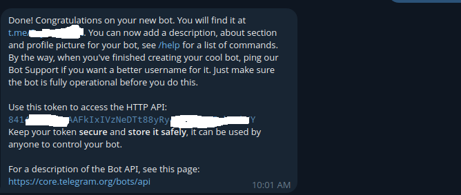

## Apa itu Clawdbot?

Clawdbot adalah aplikasi open-source untuk mengelola AI berbasis LLM dalam satu gateway terpadu. Fokus utamanya adalah automasi dan integrasi, sehingga AI bisa dipakai langsung lewat channel yang sudah familiar.

Beberapa fungsi utamanya cukup praktis untuk penggunaan harian:

1. Mengirim dan menerima pesan lewat Telegram atau WhatsApp hanya dari chat, termasuk broadcast dan automasi berbasis perintah.
2. Mendukung MCP (Model Context Protocol) ke berbagai layanan eksternal seperti Brave Search, Google Maps, hingga Google Calendar.

## Kenapa Pakai Clawdbot?

Setup-nya relatif sederhana dan tidak menuntut latar belakang teknis yang kuat. Inilah alasan kenapa adopsi Clawdbot di komunitas open-source cukup cepat, terutama untuk use-case personal automation dan small team workflow.

## Cara Setup OpenClaw / Clawdbot

Pastikan environment dasar sudah siap sebelum mulai.

### Install Node.js

Gunakan Node.js versi LTS. Jika Node belum terpasang, install terlebih dahulu sesuai sistem operasi yang Anda gunakan.

### Install Clawdbot CLI

```sh
npm install -g clawdbot@latest
````

### Mulai Proses Setup

```sh
clawdbot onboard --install-daemon
```

Perintah ini akan menjalankan wizard interaktif sekaligus meng-install gateway service sebagai user daemon.

## Jalankan dan Cek Gateway Service

```sh
systemctl --user status clawdbot-gateway
```

Pastikan status service aktif dan tidak ada error sebelum lanjut ke integrasi platform.

## Setup Telegram Bot untuk Clawdbot

Salah satu cara paling cepat memakai Clawdbot adalah lewat Telegram karena setup-nya ringan dan stabil.


Langkah yang perlu Kamu ikuti:

1. Buka Telegram dan cari **@BotFather**
2. Kirim perintah `/newbot`
3. Tentukan nama bot
4. Buat username bot (wajib diakhiri `bot`, contoh: `fianbot`)
5. BotFather akan memberikan API token
6. Salin token tersebut dan tempelkan saat wizard Clawdbot memintanya
7. Buka chat dengan bot yang baru dibuat dan kirim `/start`
8. Clawdbot sudah siap menerima perintah melalui Telegram

## Jika Muncul Error `unauthorized gateway`

Error ini cukup sering muncul di setup awal, biasanya karena gateway belum ter-authorize dengan benar atau token tidak terbaca.

Referensi diskusi dan solusi yang relevan bisa Kamu cek di sini:
[https://www.reddit.com/r/clawdbot/comments/1qrwovq/unauthorized_gateway/](https://www.reddit.com/r/clawdbot/comments/1qrwovq/unauthorized_gateway/)